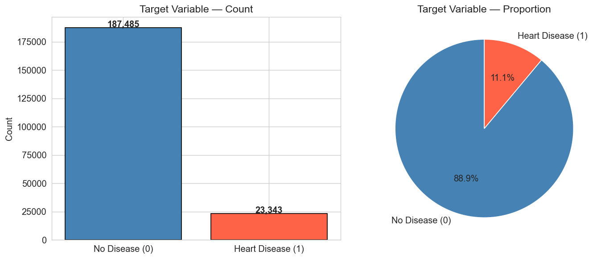
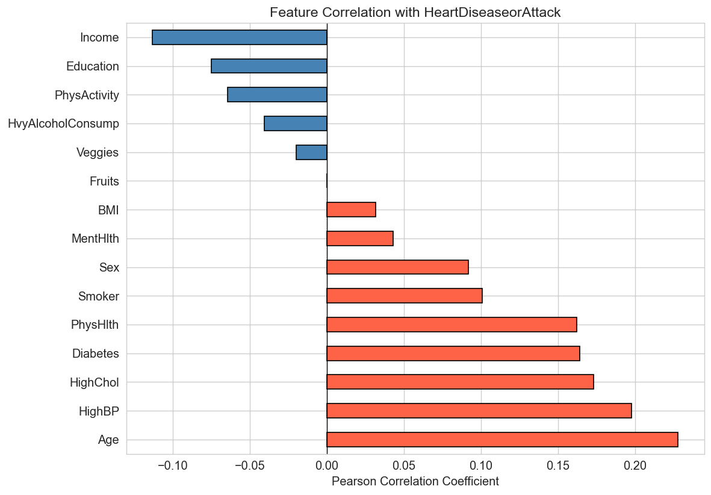
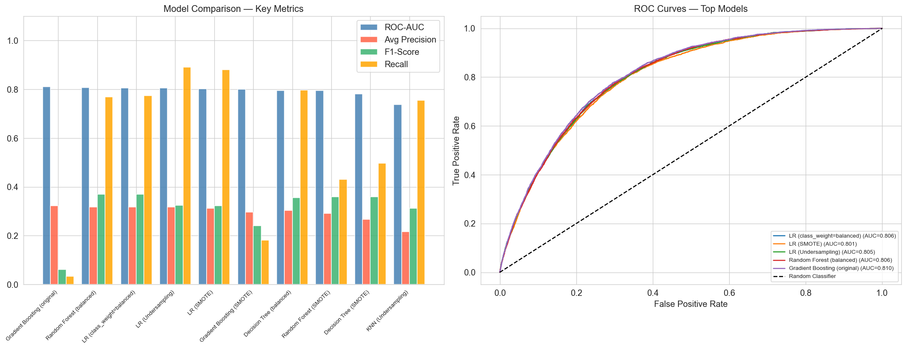
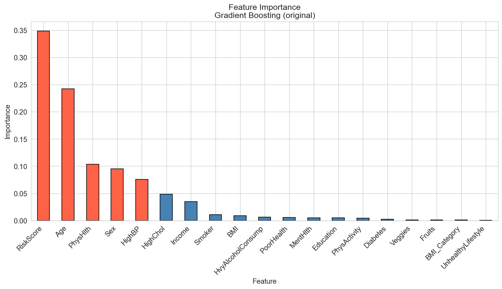
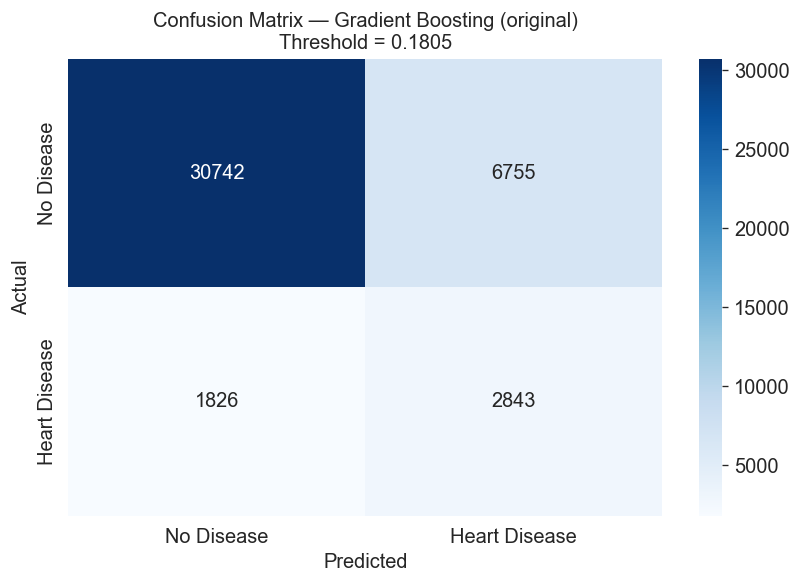
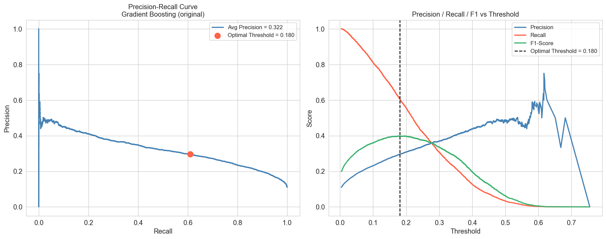
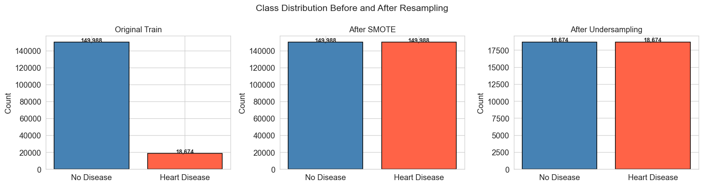
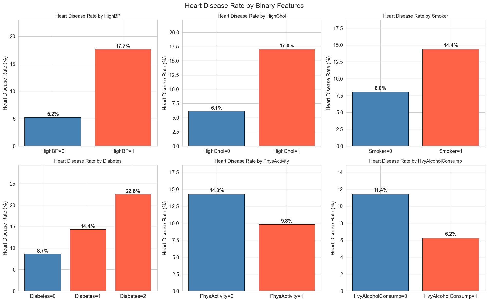

# Heart Disease Prediction — ML Classification Project

**Edureka Data Science & Machine Learning Certification | Project III**

A complete end-to-end machine learning project that predicts the probability of heart disease or attack using a 253,680-record CDC survey dataset. The project addresses a real-world challenge — severe class imbalance — through systematic experimentation with multiple models and resampling strategies.

---

## Project Goals

1. **Build the best-performing model** to predict heart disease probability
2. **Identify the most important drivers** of heart disease

---

## Skills Demonstrated

| Area | Details |
|---|---|
| **EDA** | Univariate, bivariate, and multivariate analysis across 15+ features |
| **Feature Engineering** | 4 domain-driven features: `RiskScore`, `BMI_Category`, `PoorHealth`, `UnhealthyLifestyle` |
| **Imbalanced Classification** | SMOTE oversampling, random undersampling, `class_weight='balanced'` |
| **Model Selection** | 9 model variants across 5 algorithms with systematic comparison |
| **Threshold Tuning** | Precision-Recall curve analysis to find optimal decision threshold |
| **ML Pipeline** | End-to-end sklearn/imblearn Pipeline for reproducible inference |
| **Interpretability** | Feature importance (tree-based) + Logistic Regression coefficients |

---

## Dataset

- **Source:** CDC Behavioral Risk Factor Surveillance System (BRFSS)
- **Size:** 253,680 records → 210,828 after deduplication
- **Features:** 15 health/lifestyle indicators (HighBP, HighChol, BMI, Smoker, Age, etc.)
- **Target:** `HeartDiseaseorAttack` (binary: 0 = No, 1 = Yes)
- **Challenge:** Severely imbalanced — ~91% No Disease vs ~9% Heart Disease

---

## Methodology

```
Raw Data (253,680 rows)
    ↓ Deduplication, EDA
Feature Engineering (+4 features)
    ↓ Stratified 80/20 train-test split
Resampling Strategies
  ├── class_weight='balanced'
  ├── SMOTE oversampling
  └── Random undersampling
    ↓
Model Training (9 variants)
  ├── Logistic Regression
  ├── Decision Tree
  ├── Random Forest
  ├── Gradient Boosting
  └── K-Nearest Neighbors
    ↓
Evaluation (ROC-AUC, F1, Recall, Precision-Recall curve)
    ↓
Threshold Tuning → Best model selection
    ↓
End-to-End Inference Pipeline
```

---

## Results

### Model Leaderboard (by ROC-AUC on hold-out test set)

| Rank | Model | ROC-AUC | Recall | F1-Score |
|------|-------|---------|--------|----------|
| 1 | Gradient Boosting (original) | **0.8105** | 0.033 | 0.062 |
| 2 | Random Forest (balanced) | 0.8065 | 0.768 | **0.370** |
| 3 | Logistic Regression (balanced) | 0.8060 | 0.775 | 0.369 |
| 4 | Logistic Regression (Undersampling) | 0.8055 | **0.890** | 0.325 |
| 5 | Logistic Regression (SMOTE) | 0.8014 | 0.880 | 0.323 |

> For medical use-cases, Recall (minimising false negatives) is the priority metric. The end-to-end pipeline uses **RandomForest + SMOTE**, achieving ROC-AUC 0.80 and Recall 0.65 at a balanced threshold.

### Top Drivers of Heart Disease

1. **Age** — Strongest single predictor
2. **High Blood Pressure** — Major cardiovascular risk factor
3. **BMI** — Weight-related risk
4. **RiskScore** — Composite of 5 risk factors (engineered feature)
5. **High Cholesterol** — Closely linked to cardiovascular risk

---

## Visualizations

| | |
|---|---|
|  |  |
|  |  |
|  |  |
|  |  |

---

## Project Structure

```
heart-disease-prediction/
├── heart_disease_prediction.ipynb   # Main notebook (full analysis + models)
├── data/
│   └── heartdisease.csv             # CDC BRFSS dataset
├── images/                          # All generated visualizations (15 charts)
├── certification.pdf                # Edureka program certification
└── requirements.txt                 # Python dependencies
```

---

## How to Run

```bash
# Install dependencies
pip install -r requirements.txt

# Launch Jupyter
jupyter notebook heart_disease_prediction.ipynb
```

> The notebook runs top-to-bottom without modification. All charts are saved to `images/` automatically.

---

## Tech Stack

- **Python 3.x**
- `pandas`, `numpy` — data manipulation
- `scikit-learn` — modelling, preprocessing, evaluation
- `imbalanced-learn` — SMOTE, RandomUnderSampler
- `matplotlib`, `seaborn` — visualisation

---

## Certification

This project was submitted as **Certification Project III** for the Edureka Data Science and Machine Learning program. See [`certification.pdf`](certification.pdf).
